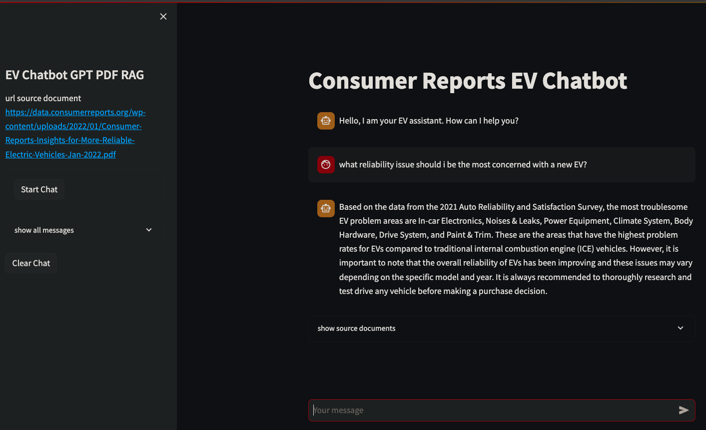
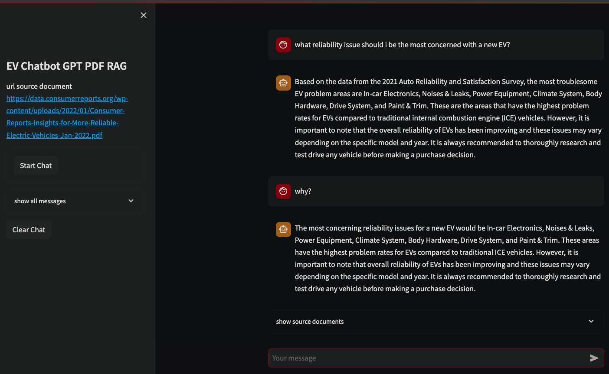
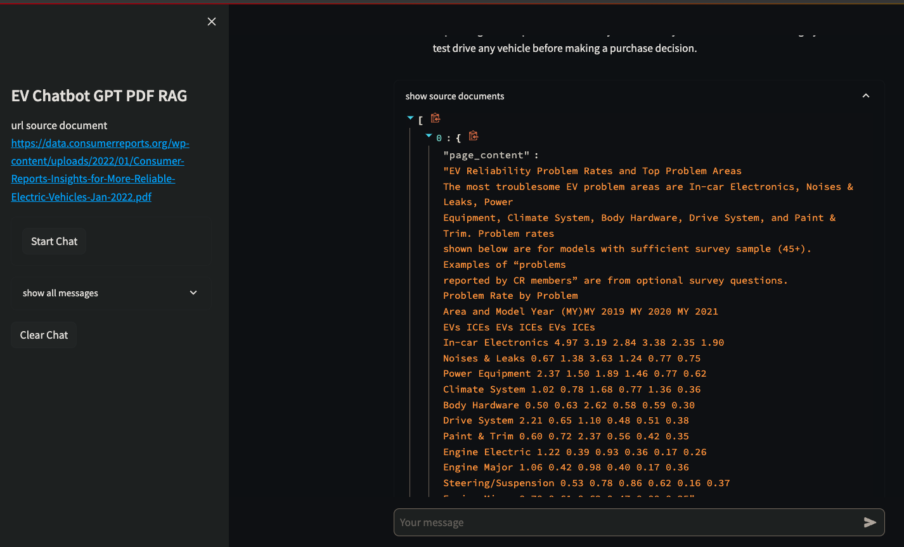
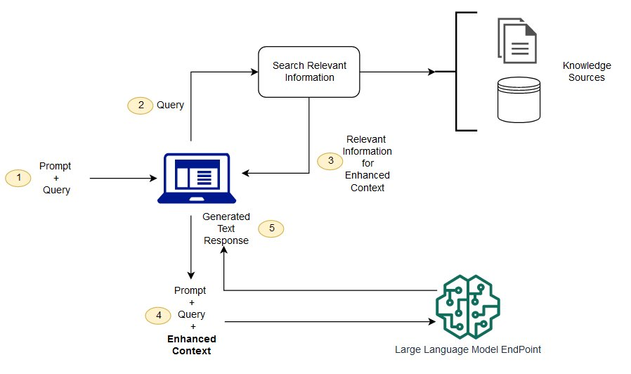

# RAG (Retrieval Augmented Generation) App with Streamlit and FastAPI Integration

#### Author: Josh Janzen

## Overview

This project demonstrates RAG (Retrieval Augmented Generation) GPT-powered application, aiming for a structure closer to what you might find in a production environment. Diverging from the common approach found in tutorials, where the application logic is predominantly integrated into the front-end, this methodology emphasizes a distinct separation between the front-end and back-end components.

This division has the credentials handled and stored on the back-end, but it also enhances the application's architecture. Streamlit serves as the interactive, user-facing front-end, whereas FastAPI manages the back-end operations, providing a robust and efficient backend service.

Also, while the chat interactions are captured and displayed through the Streamlit interface, critical elements like the prompt templates, the retrieval mechanisms, and the vector database are managed by the back-end.

### Screenshots

## Features

- **Custom GPT Conversations**: Engage in conversations generated by GPT from your own PDF documents.
- **Advanced Embeddings and Search**: Utilizes Hugging Face embeddings and FAISS vector storage for efficient retrieval and generation, enabling fast and relevant responses based on the document's content.

## RAG Flow

[source](https://aws.amazon.com/what-is/retrieval-augmented-generation/)

## Configuration Instructions

### Environment Variables
Please configure the environment variables as follows in `config/dev.env`:
- `BACKEND_HOST=` (specify the backend host URL)
- `OPENAI_API_KEY=` (provide your OpenAI API key)

### Data Preparation

1. **Download the Source PDF:**
   Download the PDF file from the following URL:
   [Consumer Reports Insights for More Reliable Electric Vehicles - Jan 2022](https://data.consumerreports.org/wp-content/uploads/2022/01/Consumer-Reports-Insights-for-More-Reliable-Electric-Vehicles-Jan-2022.pdf)

2. **Save the PDF:**
   Save the downloaded PDF into the `data` directory of your project. Ensure the file is named appropriately, for example, `Consumer-Reports-Insights-for-More-Reliable-Electric-Vehicles-Jan-2022.pdf`.

## Getting Started

### Prerequisites
- Ensure you have both Docker and Make installed on your Linux system.

### Installation Steps

1. **Build and Run Docker Containers**: Open your terminal and execute the command `make up`. This command builds and runs the necessary Docker containers for the application.

2. **Access the Streamlit Application**: Navigate to the Streamlit application in your web browser. Ensure that the ports required for accessing the application are open and accessible on your network.

3. **Initiate Chat**: On the Streamlit front-end, click the `start chat` button. The initial chat response may take approximately 10 seconds as the system is generating embeddings and storing them in the vector database for the first time. Subsequent chat interactions will be significantly faster due to the persistence of this data.

## Data Source
The project utilizes data from the following source:
- [Consumer Reports Insights for More Reliable Electric Vehicles - Jan 2022](https://data.consumerreports.org/wp-content/uploads/2022/01/Consumer-Reports-Insights-for-More-Reliable-Electric-Vehicles-Jan-2022.pdf)

## License

This project is open-sourced under the MIT License. See the [LICENSE](LICENSE) file for more details.
